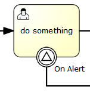

# 信号边界事件

### 描述

节点边界的中间捕获信号， 或简称为边界信号事件， 它会捕获信号定义引用的相同信号名的信号。

**注意**：与其他事件（比如边界错误事件）不同，边界信号事件不只捕获它绑定方位的信号。信号事件是一个全局的范围（广播语义），就是说信号可以在任何地方触发， 即便是不同的流程实例。

**注意**：和其他事件（比如边界错误事件）不同，捕获信号后，不会停止信号的传播。如果你有两个信号边界事件，它们捕获相同的信号事件，两个边界事件都会被触发， 即使它们在不同的流程实例中。

### 图形标记

边界信号事件显示为普通的中间事件（圆圈里有个小圆圈），位置在节点的边缘，内部有一个信号小图标。信号图标是白色的（未填充）， 来表示捕获的意思。

[](./images/bpmn.boundary.signal.event.png)

### XML

边界信号事件定义为普通的边界事件：

```xml
<boundaryEvent id="boundary" attachedToRef="task" cancelActivity="true">
          <signalEventDefinition signalRef="alertSignal"/>
</boundaryEvent>
```