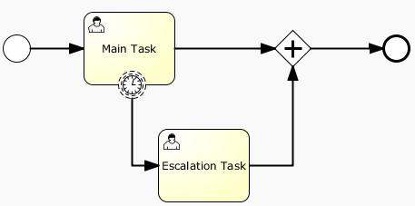

# 定时边界事件

### 描述

定时边界事件就是一个暂停等待警告的时钟。当流程执行到绑定了边界事件的环节， 会启动一个定时器。 当定时器触发时（比如，一定时间之后），环节就会中断， 并沿着定时边界事件的外出连线继续执行。

### 图形标记

定时边界事件是一个标准的边界事件（边界上的一个圆圈）， 内部是一个定时器小图标。

[](./images/bpmn.boundary.timer.event.png)

### XML

定时器边界任务定义是一个正规的边界事件。 指定类型的子元素是timerEventDefinition元素。

```xml
<boundaryEvent id="escalationTimer" cancelActivity="true" attachedToRef="firstLineSupport">
   <timerEventDefinition>
    <timeDuration>PT4H</timeDuration>
  </timerEventDefinition>
</boundaryEvent>
```

请参考定时事件定义获得更多定时其配置的细节。

在流程图中，可以看到上述例子中的圆圈边线是虚线：

[](./images/bpmn.boundary.timer.event.non.interrupting.png)

经典场景是发送一个升级邮件，但是不打断正常流程的执行。

因为BPMN 2.0中，中断和非中断的事件还是有区别的。默认是中断事件。非中断事件的情况，不会中断原始环节，那个环节还停留在原地。 对应的，会创建一个新分支，并沿着事件的流向继续执行。在XML内容中，要把cancelActivity属性设置为false：

```xml
<boundaryEvent id="escalationTimer" cancelActivity="false" attachedToRef="firstLineSupport"/>
```

**注意**：边界定时事件只能在job执行器启用时使用。 （比如，把 bpm.xml 中的jobExecutorActivate 设置为true，因为默认job执行器默认是禁用的）。