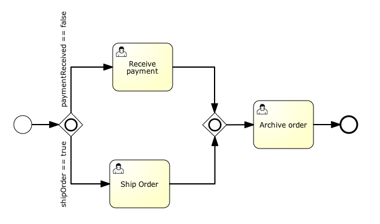

# 包含网关

### 描述

包含网关可以看做是排他网关和并行网关的结合体。 和排他网关一样，你可以在外出顺序流上定义条件，包含网关会解析它们。 但是主要的区别是包含网关可以选择多于一条顺序流，这和并行网关一样。

包含网关的功能是基于进入和外出顺序流的：

* **分支**： 所有外出顺序流的条件都会被解析，结果为true的顺序流会以并行方式继续执行， 会为每个顺序流创建一个分支。
* **汇聚**： 所有并行分支到达包含网关，会进入等待章台， 直到每个包含流程token的进入顺序流的分支都到达。 这是与并行网关的最大不同。换句话说，包含网关只会等待被选中执行了的进入顺序流。 在汇聚之后，流程会穿过包含网关继续执行。

**注意**，如果同一个包含节点拥有多个进入和外出顺序流，它就会同时含有分支和汇聚功能。这时，网关会先汇聚所有拥有流程token的进入顺序流， 再根据条件判断结果为true的外出顺序流，为它们生成多条并行分支。

### 图形标记

并行网关显示为一个普通网关（菱形），内部包含一个圆圈图标。

[](./images/bpmn.inclusive.gateway.png)

### XML

定义一个包含网关需要一行XML：

```xml
<inclusiveGateway id="myInclusiveGateway" />
```

实际的行为（分支，汇聚或同时分支汇聚）， 是由连接在包含网关的顺序流决定的。

参考如下代码：

```xml
    <startEvent id="theStart" />
    <sequenceFlow id="flow1" sourceRef="theStart" targetRef="fork" />

    <inclusiveGateway id="fork" />
    <sequenceFlow sourceRef="fork" targetRef="receivePayment" >
    <conditionExpression xsi:type="tFormalExpression">${paymentReceived == false}</conditionExpression>
    </sequenceFlow>
    <sequenceFlow sourceRef="fork" targetRef="shipOrder" >
    <conditionExpression xsi:type="tFormalExpression">${shipOrder == true}</conditionExpression>
    </sequenceFlow>

    <userTask id="receivePayment" name="Receive Payment" />
    <sequenceFlow sourceRef="receivePayment" targetRef="join" />

    <userTask id="shipOrder" name="Ship Order" />
    <sequenceFlow sourceRef="shipOrder" targetRef="join" />

    <inclusiveGateway id="join" />
    <sequenceFlow sourceRef="join" targetRef="archiveOrder" />

    <userTask id="archiveOrder" name="Archive Order" />
    <sequenceFlow sourceRef="archiveOrder" targetRef="theEnd" />

    <endEvent id="theEnd" />
```

在上面的例子中，流程开始之后，如果流程变量为paymentReceived == false和shipOrder == true，就会创建两个任务。如果，只有一个流程变量为true，就会只创建一个任务。如果没有条件为true，就会抛出一个异常。如果想避免异常，可以定义一个默认顺序流。下面的例子中，会创建一个任务，发货任务：

```java
HashMap<String, Object> variableMap = new HashMap<String, Object>();
          variableMap.put("receivedPayment", true);
          variableMap.put("shipOrder", true);
          ProcessInstance pi = runtimeService.startProcessInstanceByKey("forkJoin");
TaskQuery query = taskService.createTaskQuery()
                         .processInstanceId(pi.getId())
                         .orderByTaskName()
                         .asc();

List<Task> tasks = query.list();
assertEquals(1, tasks.size());

Task task = tasks.get(0);
assertEquals("Ship Order", task.getName());
```

当任务完成后，第二个包含网关会汇聚两个分支， 因为只有一个外出顺序流，所以不会创建并行分支， 只有归档订单任务会被激活。

注意，包含网关不需要“平衡”（比如，对应包含网关的进入和外出数目需要相等）。包含网关会等待所有进入顺序流完成， 并为每个外出顺序流创建并行分支， 不会受到流程中其他元素的影响。