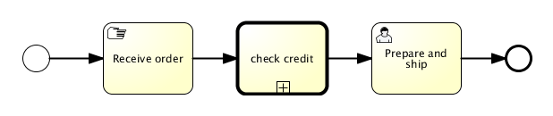

# 外部引用（调用活动）子流程

### 描述

bpmn 2.0区分了普通子流程， 也叫做嵌入式子流程和外部引用（调用活动）子流程。两者看起来很相似，单从概念上讲，当流程抵达节点时，两者都会调用子流程。

不同点是外部引用子流程会引用流程定义以外的一个流程，被引用的子流程会内嵌到原始的流程定义中。使用外部引用子流程的主要场景是需要重用流程定义， 这个流程定义需要被很多其他流程定义调用的时候。

当流程执行到调用节点，会创建一个新分支，它是到达调用节点的流程的分支。这个分支会用来执行子流程，默认创建并行子流程，就像一个普通的流程。 上级流程会等待子流程完成，然后才会继续向下执行。

### 图形标记

调用节点显示与子流程相同， 不过是粗边框（无论是折叠和展开的）。根据不同的建模工具，调用节点也可以展开，但是显示为折叠的子流程。

[](./images/bpmn.call.activity.collapsed.png)

### XML

外部引用子流程在流程定义中为一个标准的活动，他需要使用 callActivity 标记并根据 peocessDefinitionKey 引用一个外部的流程定义。在实际的应用中即意味着指定 processDefinitionKey 所代表的流程将被 callActivity 节点调用。

```xml
<callActivity id="callCheckCreditProcess" name="Check credit" calledElement="checkCreditProcess" />
```

注意，子流程的流程定义是在执行阶段解析的。 就是说子流程可以与调用的流程分开部署，如果需要的话。

###传递变量

可以把流程变量传递给子流程，反之亦然。数据会复制给子流程，当它启动的时候，并在它结束的时候复制回主流程。

```xml
<callActivity id="callSubProcess" calledElement="checkCreditProcess" >
  <extensionElements>
    <activiti:in source="someVariableInMainProcess" target="nameOfVariableInSubProcess"/>
    <activiti:out source="someVariableInSubProcss" target="nameOfVariableInMainProcess"/>
  </extensionElements>
</callActivity>
```

我们使用activiti扩展来简化BPMN标准元素调用dataInputAssociation和dataOutputAssociation，这只在你使用BPMN 2.0标准方式声明流程变量才管用。

这里也可以使用表达式：

```xml
<callActivity id="callSubProcess" calledElement="checkCreditProcess" >
  <extensionElements>
    <activiti:in sourceExpression="${x+5}" target="y" />
    <activiti:out source="${y+5}" target="z" />
  </extensionElements>
</callActivity>
```

最后``` z = y + 5 = x + 5 + 5 ```

### 实例

下面的流程图演示了简单订单处理。先判断客户端信用，这可能与很多其他流程相同。检查信用阶段这里设计成调用节点。

[](./images/bpmn.call.activity.super.process.png)

流程看起来像下面这样：

```xml
<startEvent id="theStart" />
<sequenceFlow id="flow1" sourceRef="theStart" targetRef="receiveOrder" />

<manualTask id="receiveOrder" name="Receive Order" />
<sequenceFlow id="flow2" sourceRef="receiveOrder" targetRef="callCheckCreditProcess" />

<callActivity id="callCheckCreditProcess" name="Check credit" calledElement="checkCreditProcess" />
<sequenceFlow id="flow3" sourceRef="callCheckCreditProcess" targetRef="prepareAndShipTask" />

<userTask id="prepareAndShipTask" name="Prepare and Ship" />
<sequenceFlow id="flow4" sourceRef="prepareAndShipTask" targetRef="end" />

<endEvent id="end" />
```

被应用的子流程看起来像下面这样：

[](./images/bpmn.call.activity.sub.process.png)

子流程的流程定义没有什么特别的。 它也可以单独使用，不用其他流程调用。