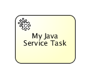

# Java 服务任务

### 描述

java服务任务用来调用外部java类。


### 图形标记

服务任务显示为圆角矩形，左上角有一个齿轮小图标。

[](./images/bpmn.java.service.task.png)

### XML

脚本任务定义需要指定script 和scriptFormat。

有4钟方法来声明java调用逻辑：

* 实现JavaDelegate或ActivityBehavior
* 执行解析代理对象的表达式
* 调用一个方法表达式
* 调用一直值表达式

执行一个在流程执行中调用的类， 需要在'activiti:class'属性中设置全类名。

```xml
<serviceTask id="javaService"
             name="My Java Service Task"
             activiti:class="org.activiti.MyJavaDelegate" />
```

也可以使用表达式调用一个对象。对象必须遵循一些规则， 并使用activiti:class属性进行创建。

```xml
 <serviceTask id="serviceTask" activiti:delegateExpression="${delegateExpressionBean}" />
```
这里，delegateExpressionBean是一个实现了JavaDelegate接口的bean， 它定义在实例的spring容器中。

要指定执行的UEL方法表达式， 需要使用activiti:expression。

```xml
<serviceTask id="javaService"
             name="My Java Service Task"
             activiti:expression="#{printer.printMessage()}" />
```
方法printMessage（无参数）会调用 名为printer对象的方法。

也可以为表达式中的方法传递参数。

```xml
<serviceTask id="javaService"
             name="My Java Service Task"
             activiti:expression="#{printer.printMessage(execution, myVar)}" />
```

这会调用名为printer对象上的方法printMessage。 第一个参数是DelegateExecution，在表达式环境中默认名称为execution。 第二个参数传递的是当前流程的名为myVar的变量。

要指定执行的UEL值表达式， 需要使用activiti:expression属性。

```xml
<serviceTask id="javaService"
             name="My Java Service Task"
             activiti:expression="#{split.ready}" />
```

ready属性的getter方法，getReady（无参数）， 会作用于名为split的bean上。 这个对象会被解析为流程对象和 （如果合适）spring环境中的对象。

### 实现

要在流程执行中实现一个调用的类，这个类需要实现org.activiti.engine.delegate.JavaDelegate接口， 并在execute方法中提供对应的业务逻辑。 当流程执行到特定阶段，它会指定方法中定义好的业务逻辑， 并按照默认BPMN 2.0中的方式离开节点。

让我们创建一个java类的例子，它可以流程变量中字符串转换为大写。 这个类需要实现org.activiti.engine.delegate.JavaDelegate接口， 这要求我们实现execute(DelegateExecution)方法。 它包含的业务逻辑会被引擎调用。流程实例信息，如流程变量和其他信息， 可以通过 DelegateExecution 接口访问和操作。

```java
public class ToUppercase implements JavaDelegate {

  public void execute(DelegateExecution execution) throws Exception {
    String var = (String) execution.getVariable("input");
    var = var.toUpperCase();
    execution.setVariable("input", var);
  }

}
```

注意：serviceTask定义的class只会创建一个java类的实例。 所有流程实例都会共享相同的类实例，并调用execute(DelegateExecution)。 这意味着，类不能使用任何成员变量，必须是线程安全的，它必须能模拟在不同线程中执行。 这也影响着属性注入的处理方式。

流程定义中引用的类（比如，使用activiti:class）不会 在部署时实例化。只有当流程第一次执行到使用类的时候， 类的实例才会被创建。如果找不到类，会抛出一个ActivitiException。 这个原因是部署环境（更确切是的classpath）和真实环境往往是不同的。 比如当使用ant或业务归档上传到Activiti Explorer来发布流程 classpath没有包含引用的类。

### 属性注入

可以为代理类的属性注入数据。支持如下类型的注入：

* 固定的字符串
* 表达式

如果有效的话，数值会通过代理类的setter方法注入，遵循java bean的命名规范（比如fistName属性对应setFirstName(...)方法）。如果属性没有对应的setter方法，数值会直接注入到私有属性中。一些环境的SecurityManager不允许修改私有属性，所以最好还是把你想注入的属性暴露出对应的setter方法来。 无论流程定义中的数据是什么类型，注入目标的属性类型都应该是 org.activiti.engine.delegate.Expression。

下面代码演示了如何把一个常量注入到属性中。 属性注入可以使用'class'属性。 注意我们需要定义一个'extensionElements' XML元素， 在声明实际的属性注入之前，这是BPMN 2.0 XML格式要求的。

```xml
<serviceTask id="javaService"
    name="Java service invocation"
    activiti:class="org.activiti.examples.bpmn.servicetask.ToUpperCaseFieldInjected">
    <extensionElements>
      <activiti:field name="text" stringValue="Hello World" />
  </extensionElements>
</serviceTask>
```

ToUpperCaseFieldInjected类有一个text属性， 类型是org.activiti.engine.delegate.Expression。 调用text.getValue(execution)时，会返回定义的字符串Hello World。

也可以使用长文字（比如，内嵌的email），可以使用'activiti:string'子元素：

```xml
<serviceTask id="javaService"
    name="Java service invocation"
    activiti:class="org.activiti.examples.bpmn.servicetask.ToUpperCaseFieldInjected">
  <extensionElements>
    <activiti:field name="text">
        <activiti:string>
          Hello World
      </activiti:string>
    </activiti:field>
  </extensionElements>
</serviceTask>
```

可以使用表达式，实现在运行期动态解析注入的值。这些表达式可以使用流程变量或spring定义的bean（如果使用了spring）。 像服务任务实现里说的那样，服务任务中的java类实例会在所有流程实例中共享。 为了动态注入属性的值，我们可以在org.activiti.engine.delegate.Expression中使用值和方法表达式， 它会使用传递给execute方法的DelegateExecution参数进行解析。

```xml
<serviceTask id="javaService" name="Java service invocation"
  activiti:class="org.activiti.examples.bpmn.servicetask.ReverseStringsFieldInjected">
  <extensionElements>
    <activiti:field name="text1">
      <activiti:expression>${genderBean.getGenderString(gender)}</activiti:expression>
    </activiti:field>
    <activiti:field name="text2">
       <activiti:expression>Hello ${gender == 'male' ? 'Mr.' : 'Mrs.'} ${name}</activiti:expression>
    </activiti:field>
  </extensionElements>
</serviceTask>
```

下面的例子中，注入了表达式，并使用在传入的当前DelegateExecution解析它们。

```java
public class ReverseStringsFieldInjected implements JavaDelegate {

    private Expression text1;
    private Expression text2;

    public void execute(DelegateExecution execution) {
        String value1 = (String) text1.getValue(execution);
        execution.setVariable("var1", new StringBuffer(value1).reverse().toString());

        String value2 = (String) text2.getValue(execution);
        execution.setVariable("var2", new StringBuffer(value2).reverse().toString());
    }
}
```

另外，你也可以把表达式设置成一个属性，而不是字元素，让XML更简单一些。

```xml
<activiti:field name="text1" expression="${genderBean.getGenderString(gender)}" />
<activiti:field name="text1" expression="Hello ${gender == 'male' ? 'Mr.' : 'Mrs.'} ${name}" />
```

** 注意**：因为java类实例会被重用，注入只会发生一次，当服务任务调用第一次的时候。 当你的代码中的属性改变了，值也不会重新注入， 所以你应该把它们看做是不变的，不用修改它们。

### 服务任务结果

服务流程返回的结果（使用表达式的服务任务）可以分配给已经存在的或新的流程变量， 可以通过指定服务任务定义的'activiti:resultVariable'属性来实现。 指定的路程比那两的值会被服务流程的返回结果覆盖。 如果没有指定返回变量名，就会忽略返回结果。

```xml
<serviceTask id="aMethodExpressionServiceTask"
    activiti:expression="#{myService.doSomething()}"
    activiti:resultVariable="myVar" />
```

在上面的例子中，服务流程的返回值（在'myService'上调用'doSomething()'方法的返回值， myService可能是流程变量，也可能是spring的bean），会设置到名为'myVar'的流程变量里， 在服务执行完成之后。