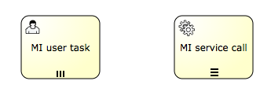

# 多任务实例

### 描述

多实例节点是在业务流程中定义重复环节的一个方法。 从开发角度讲，多实例和循环是一样的： 它可以根据给定的集合，为每个元素执行一个环节甚至一个完整的子流程， 既可以顺序依次执行也可以并发同步执行。

多实例是在一个普通的节点上添加了额外的属性定义 （所以叫做'多实例特性'），这样运行时节点就会执行多次。 下面的节点都可以成为一个多实例节点：

* User Task
* Script Task
* Java Service Task
* Web Service Task
* Business Rule Task
* Email Task
* Manual Task
* Receive Task
* (Embedded) Sub-Process
* Call Activity

网关和事件 不能设置多实例。

根据规范的要求，每个上级流程为每个实例创建分支时都要提供如下变量：

* nrOfInstances：实例总数
* nrOfActiveInstances：当前活动的，比如，还没完成的，实例数量。 对于顺序执行的多实例，值一直为1。
* nrOfCompletedInstances：已经完成实例的数目。

可以通过execution.getVariable(x)方法获得这些变量。

另外，每个创建的分支都会有分支级别的本地变量（比如，其他实例不可见， 不会保存到流程实例级别）：

* loopCounter：表示特定实例的在循环的索引值。可以使用activiti的elementIndexVariable属性修改loopCounter的变量名。


### 图形标记

如果节点是多实例的，会在节点底部显示三条短线。 三条竖线表示实例会并行执行。 三条横线表示顺序执行。

[](./images/bpmn.multi.instance.png)


### XML

要把一个节点设置为多实例，节点xml元素必须设置一个multiInstanceLoopCharacteristics子元素。

```xml
<multiInstanceLoopCharacteristics isSequential="false|true">
 ...
</multiInstanceLoopCharacteristics>
```

isSequential属性表示节点是进行 顺序执行还是并行执行。

实例的数量会在进入节点时计算一次。 有一些方法配置它。一种方法是使用loopCardinality子元素直接指定一个数字。

```xml
<multiInstanceLoopCharacteristics isSequential="false|true">
  <loopCardinality>5</loopCardinality>
</multiInstanceLoopCharacteristics>
```

也可以使用结果为整数的表达式：

```xml
<multiInstanceLoopCharacteristics isSequential="false|true">
  <loopCardinality>${nrOfOrders-nrOfCancellations}</loopCardinality>
</multiInstanceLoopCharacteristics>
```

另一个定义实例数目的方法是，通过loopDataInputRef子元素，设置一个类型为集合的流程变量名。 对于集合中的每个元素，都会创建一个实例。 也可以通过inputDataItem子元素指定集合。 下面的代码演示了这些配置：

```xml
<userTask id="miTasks" name="My Task ${loopCounter}" activiti:assignee="${assignee}">
  <multiInstanceLoopCharacteristics isSequential="false">
    <loopDataInputRef>assigneeList</loopDataInputRef>
    <inputDataItem name="assignee" />
  </multiInstanceLoopCharacteristics>
</userTask>
```

假设assigneeList变量包含这些值[kermit, gonzo, foziee]。 在上面代码中，三个用户任务会同时创建。每个分支都会拥有一个用名为assignee的流程变量， 这个变量会包含集合中的对应元素，在例子中会用来设置用户任务的分配者。

loopDataInputRef和inputDataItem的缺点是1）名字不好记， 2）根据BPMN 2.0格式定义，它们不能包含表达式。activiti通过在 multiInstanceCharacteristics中设置 collection和 elementVariable属性解决了这个问题：

```xml
<userTask id="miTasks" name="My Task" activiti:assignee="${assignee}">
  <multiInstanceLoopCharacteristics isSequential="true"
     activiti:collection="${myService.resolveUsersForTask()}" activiti:elementVariable="assignee" >
  </multiInstanceLoopCharacteristics>
</userTask>
```

多实例节点在所有实例都完成时才会结束。也可以指定一个表达式在每个实例结束时执行。 如果表达式返回true，所有其他的实例都会销毁，多实例节点也会结束，流程会继续执行。 这个表达式必须定义在completionCondition子元素中。

```xml
<userTask id="miTasks" name="My Task" activiti:assignee="${assignee}">
  <multiInstanceLoopCharacteristics isSequential="false"
     activiti:collection="assigneeList" activiti:elementVariable="assignee" >
    <completionCondition>${nrOfCompletedInstances/nrOfInstances >= 0.6 }</completionCondition>
  </multiInstanceLoopCharacteristics>
</userTask>
```

在这里例子中，会为assigneeList集合的每个元素创建一个并行的实例。 当60%的任务完成时，其他任务就会删除，流程继续执行。

