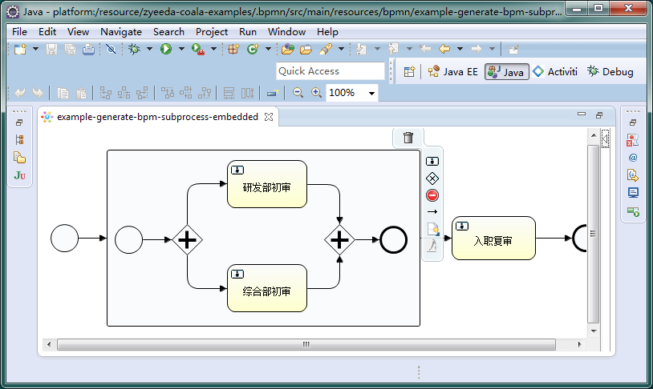
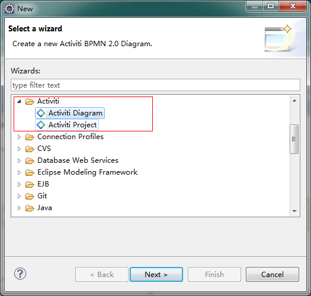

# 设计器

目前流程设计使用 Activiti BPMN 2.0 designer，此工具是 Activiti 提供的一款 Eclipse 插件。利用 Activiti BPMN 2.0 designer 可以进行流程建模。

### 安装
* 下载并安装 Eclipse，需要下载4.3(kepler)或以上版本，<a href="http://www.eclipse.org/downloads/packages/eclipse-ide-java-ee-developers/keplersr2" target="_blank">下载地址</a> 。
* 安装插件 Activiti BPMN 2.0 designer，插件地址：http://activiti.org/designer/update/

<!--  -->

 
