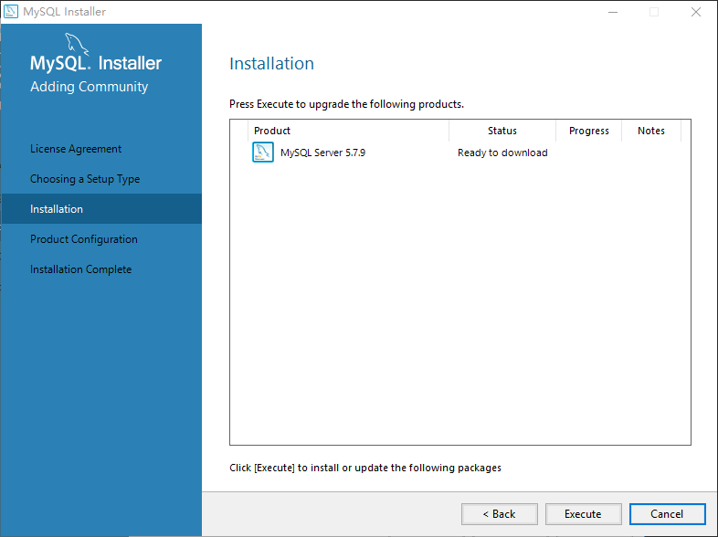

# Windows

以下配置过程在 Windows 10 系统上测试通过。

## 安装软件环境

在没有特别说明的情况下，以下操作都是在命令提示符窗口下完成的。但需要注意的是，因为安装过程涉及到系统级别的变更，需要使用管理员身份打开命令提示符窗口。方法是在程序图标上右击，并选择“以管理员身份运行”。

### 安装 Chocolatey NuGet

[Chocolatey NuGet](https://chocolatey.org/) 是 Windows 系统上的包管理工具，同 Ubuntu 上的 apt-get，OS X 上的 Homebrew 一样，使用 Chocolatey NuGet 也可以方便的安装和管理所需要的软件。

运行以下命令来安装 Chocolatey NuGet：

```cmd
C:\> @powershell -NoProfile -ExecutionPolicy Bypass -Command "iex ((new-object net.webclient).DownloadString('https://chocolatey.org/install.ps1'))" && SET PATH=%PATH%;%ALLUSERSPROFILE%\chocolatey\bin
```

为了在卸载的时候 Chocolatey NuGet 会自动运行卸载程序，需要为 Chocolatey NuGet 设置一个参数：

```cmd
C:\> choco feature enable -n autoUninstaller
```

### 安装 Git

```cmd
C:\> choco install git.install --params="/GitAndUnixToolsOnPath /NoAutoCrlf" -y
```

### 安装 Node.js

```cmd
C:\> choco install nodejs.install -y
```

### 安装 CoffeeScript

为了使得上一步安装的 Node.js 软件生效，需要退出当前的命令提示符窗口，再重新打开。注意重新打开的时候要使用管理员权限。

```cmd
C:\> npm install -g coffee-script@1.8.0
```

### 安装 JDK

```cmd
C:\> choco install jdk8 -y
```

### 安装 Maven

由于 Chocolatey NuGet 官方提供的安装包无法成功安装 Maven，因此这一步需要手工进行。

* 到 [Maven](https://maven.apache.org/) 网站上下载最新版本的压缩包；
* 将压缩包解压到某个目录，例如 `C:\Maven`；
* 设置环境变量 `MAVEN_HOME`，并指向解压后的 Maven 目录；
* 修改 `PATH` 环境变量，添加搜索路径 `%MAVEN_HOME%\bin`；
* 设置环境变量 `MAVEN_OPTS`，值为 `-Dfile.encoding=UTF-8`。

打开一个全新的命令提示符窗口，执行 `mvn --version` 命令，如果输出以下信息则说明安装成功。

```
Apache Maven 3.3.9 (bb52d8502b132ec0a5a3f4c09453c07478323dc5; 2015-11-10T08:41:47-08:00)
Maven home: C:\Maven\bin\..
Java version: 1.8.0_65, vendor: Oracle Corporation
Java home: C:\Program Files\Java\jdk1.8.0_65\jre
Default locale: zh_CN, platform encoding: UTF-8
OS name: "windows 10", version: "10.0", arch: "amd64", family: "dos"
```

提示:

* 根据 CPU 架构、操作系统、安装版本和安装路径的不同，输出的信息会有所差别；
* platform encoding 的值应该是 UTF-8，如果显示为 GBK，请查看 `MAVEN_OPTS` 环境变量的设置是否正确。

### 安装 MySQL

使用 Chocolatey NuGet 安装后的 MySQL 服务无法自动配置，而手动配置的过程又非常繁琐，因此还是使用官方提供的安装程序来完成安装。

首先在 [MySQL](http://www.mysql.com/) 网站上下载 Windows 安装程序（最好下载体积较小的在线安装包，因为我们只需要安装其中的一个组件——MySQL 服务器）。截止到文档编写时，MySQL Server 的最新版本为 5.7.9。下载完成以后运行安装程序，具体步骤如下：

* 安装程序启动：


* 同意授权声明：


* 选择需要安装的组件，这里我们选择 **Server only**：


* 准备下载所选择的组件：


* 正在下载：


* 正在安装：


* 安装完成：


* 准备配置：


* 服务器类型和网络配置：


* 账户和角色配置。为了后续配置方便，在这里统一将 root 用户的密码设置为 `mysecretpassword`：


* Windows 服务配置：


* 准备应用服务器配置：


* 正在应用服务器配置：


* 应用服务器配置完成：


* 产品配置摘要界面（只有一个产品）：


* 安装完成：


安装完成以后还需要进行两步后续配置：

1. 将 MySQL Server 的 `bin` 目录添加到 `PATH` 路径中，默认安装的情况下 `bin` 目录所在的路径为 `C:\Program Files\MySQL\MySQL Server 5.7\bin`；
2. 修改 `C:\Windows\System32\drivers\etc\hosts` 文件（此文件需要使用管理员权限修改），添加以下内容，将 mysql 域名解析到本地 IP 地址 127.0.0.1。

```
127.0.0.1   mysql
```

## 下载 CDE.IO 源代码

假设以下命令都是在 `C:\Users\zyeeda` 目录下执行的。

```cmd
C:\Users\zyeeda> git clone -b develop https://github.com/zyeeda/origin
C:\Users\zyeeda> git clone -b develop https://github.com/zyeeda/cdeio-runtime
C:\Users\zyeeda> git clone -b develop https://github.com/zyeeda/colorvest
```

命令运行完成以后，会在 `C:\Users\zyeeda` 目录下生成三个子目录，分别是 `origin`、`cdeio-runtime` 和 `colorvest`。

## 编译

### 编译 origin 项目

```cmd
C:\Users\zyeeda> cd origin
C:\Users\zyeeda> mvn clean install
```

### 编译 cdeio-runtime 项目

```cmd
C:\Users\zyeeda> cd cdeio-runtime
C:\Users\zyeeda> mvn clean install
```

### 编译 colorvest 项目

```cmd
C:\Users\zyeeda> cd colorvest
C:\Users\zyeeda> coffee -c .
C:\Users\zyeeda> coffee -b -c cdeio/require-config.coffee
```

## 运行示例项目

### 下载 colorvest-samples 项目源代码

```cmd
C:\Users\zyeeda> git clone -b develop https://github.com/zyeeda/colorvest-samples
```

### 编译

```cmd
C:\Users\zyeeda> cd colorvest-samples
C:\Users\zyeeda> mvn clean package
```

### 创建数据库

```cmd
C:\Users\zyeeda> mysql -u root -p -e "CREATE DATABASE `cdeio-samples` DEFAULT CHARACTER SET = UTF8"
```

**注：如果变更上述命令创建的数据库名称，则需要更改 colorvest-samples 项目的配置。**

### 导入数据库表结构

```cmd
C:\Users\zyeeda> mvn flyway:migrate
```

### 链接 colorvest 项目

```cmd
C:\Users\zyeeda> mklink /D C:\Users\zyeeda\colorvest-samples\src\main\webapp\scripts\cdeio C:\Users\zyeeda\colorvest\cdeio
```

**注意：如果源代码仓库没有下载到 `C:\Users\zyeeda` 目录下，则以上命令需要做相应的修改。**

**提示：如果系统没有 mklink 命令，需要下载 [junction](https://technet.microsoft.com/en-us/sysinternals/bb896768.aspx) 程序。将 junction.exe 文件放置在 `C:\Users\zyeeda` 目录下，然后运行以下命令：**

```cmd
C:\Users\zyeeda> junction C:\Users\zyeeda\colorvest\cdeio C:\Users\zyeeda\colorvest-samples\src\main\webapp\scripts\cdeio
```

### 运行

```cmd
C:\Users\zyeeda> cd colorvest-samples
C:\Users\zyeeda\colorvest-samples> mvn jetty:run
```

待启动完成以后，使用浏览器访问 https://localhost:8000/cdeio-samples 即可访问系统。输入相同的用户名和密码就可以登录，开始浏览和学习项目提供的演示样例及相关代码吧。

**提示：系统成功启动以后，会出现一个 JavaScript 调试窗口，这个窗口在后续代码的开发过程中将非常有用，建议不要关闭。当启动之后第一次登录进系统，会发现浏览器卡在一个空白的页面，这时候切换到调试窗口，点一下窗口上面的 Go 按钮即可。这是因为该调试器拦截了服务器端 JavaScript 的执行入口。**