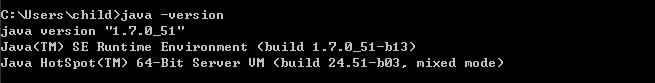

# JDK

Cdeio 需要运行在 JDK 7 或更高版本上。使用 Cdeio 所开发的项目能够部署在 JDK 6 或更高版本上，建议部署在 JDK 8 上。 进入 Oracle Java SE 下载页面下载并安装，页面上提供了安装的方法。 为了验证是否安装成功，可以在命令行中执行 ```java -version```，它将会打印出安装的 JDK 的版本。
* JDK 下载地址：http://www.oracle.com/technetwork/java/javase/downloads/index.html
* 运行 ```java -version 命令```，如果安装成功将显示如下信息：
[](./images/jdk_success.png)