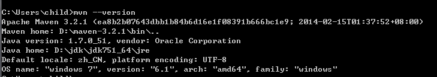

# Maven

Maven 是一个项目管理工具，进入 <a href="http://maven.apache.org/" target="_blank">&nbsp;Maven&nbsp;</a> 官方网站可以了解更加详细的信息。Cdeio 使用 Maven 对项目进行构建和管理，所以在使用 Cdeio 之前需要<a href="http://maven.apache.org/download.cgi" target="_blank">&nbsp;**下载**&nbsp;</a>并配置 Maven。

### 配置

我们以 ```D:\maven-3.2.1``` 为 Maven 的根目录为例进行配置

* 在环境变量中创建 ```MAVEN_HOME``` 变量， 并将变量值设置为 ```D:\maven-3.2.1```。
* 在环境变量 ```PATH``` 值的最前面加入 ```%MAVEN_HOME%\bin;``` 配置。
* 在环境变量中创建 ```MAVEN_OPTS``` 变量， 并将变量值设置为 ```-Dfile.encoding=UTF-8```。

为了验证配置是否成功，可以在命令行中执行 ```mvn --version```, 它将会打印出 Maven 版本信息。

[](./images/maven_success.png)